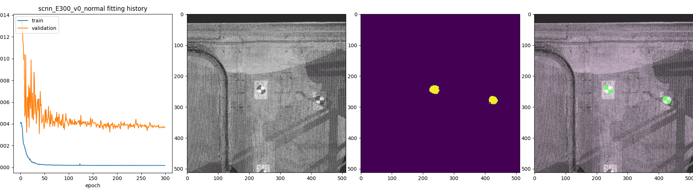
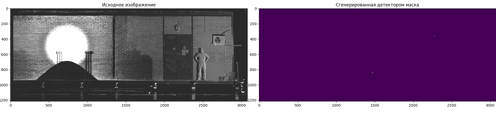
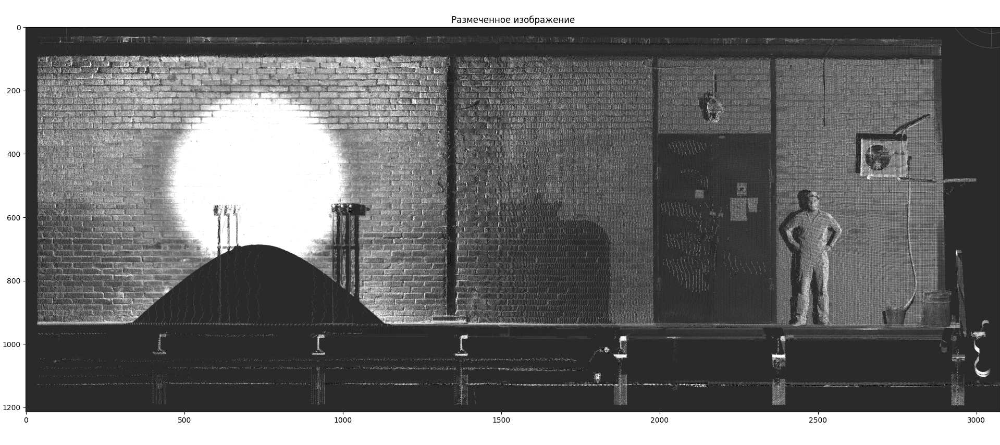
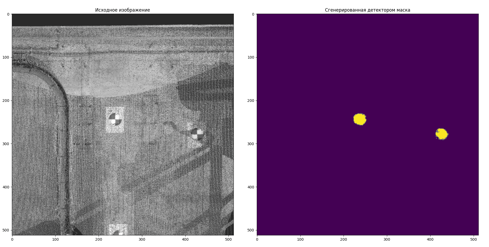
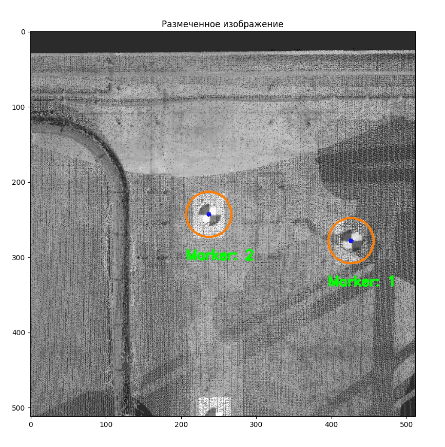
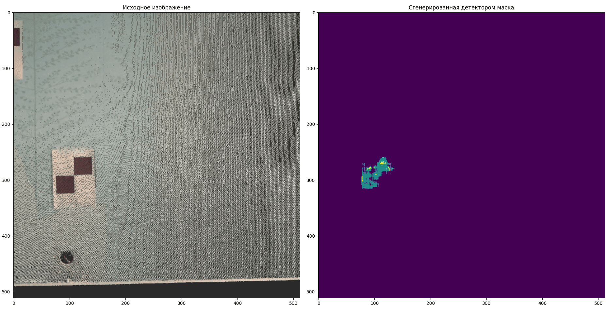
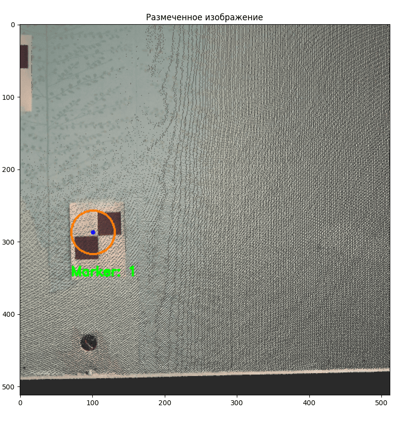

# Нахождение маркеров на изображении
## Описание
Задача нахождения объектов на изображении - классическая задача компьютерного зрения. Но в данном наборе изображений искомые объекты, маркеры, как и сами изображения, имеют чрезвычайно высокий уровень шумов, из-за того, что это скриншоты облака точек.

Для решения такой нетривиальной задачи, после некоторых экспериментов, была использована нейросеть для семантической сегментации на основе UNet. Данная модель получает на вход изображение фиксированного размера (в этом случае 512х512х3), а возвращает маску с метками класса на месте искомых объектов.

Но для нейросети нужны данные, на которых она сможет учится. Разбив все изображения(кроме одного) на одинаковые кусочки удалось получить 14 масок с  маркерами, для обучения можно использовать только 13 из них, а одну оставить для оценки качества обучения модели. Для увеличения обучающей выборки была произведена аугментация данных, добавление в выборку исходных, но немного изменненых данных.

Ввиду того, что уровень зашумленности в районе маркеров разный, было собрано 2 датасета. Из одного было выбрано изображение для оценки с высоким уровнем шумов у маркера(hard), а из другого с более низким(normal). 

На основе обученной сети был разработан детектор, способный принимать на вход изображение произвольного размера и выдавать маску и размеченное изображение с указанием на центры найденных маркеров. Модуль SCNN использует дифферинциальную архитектуру, то есть подгружается несколько моделей, в данном случае 2, а потом итоговый выриант выдачи строится только на частях, общих для выдачи обоих моделей, это позволяет избавится от большого количества шумов, даваемых каждой моделью по-отдельности. Итоговый вариант маски проходит обработку для отсечения малых остаточных шумов и сглаживания контуров предсказанных масок. После на маске находятся отдельные скопления пикселей, вычисляются их центры и наносятся на копию изначального изображения.
## Стркутура проекта 
```
.
├── data
│   ├── dataset
│   │   ├── hard
│   │   ├── normal
│   │   └── test
│   └── images
│       ├── Screenshot_4.png
│       ├── target
│       ├── target_source.png
│       ├── template.png
│       ├── tmp2.png
│       └── validation
├── main.py
├── Prepare.py
├── requirements.txt
├── SCNN.py
├── SCNN_train.py
└── weights
    ├── scnn_E100_v0_hard.h5
   ...
    └── scnn_E50_v1_normal.h5
```
## Зависимости
Для начала необходимо чтобы на компьютере были установлены Python, CUDA и CUDNN. Установить требуемые модули python можно выполнив команду ниже:
```
pip install –r requirements.txt
```
## Детектор
### Обучение модели
Основные параметры модели, их можно менять в коде для создания собственной модели)
```
train_dif - отвечает за сложность контрольного изображения, тоесть данное изображение и его маска были убраны из оригинального датасета, что бы модель не могла обучится на нем и была возможно оценки качества обучения.
data_dir - путь к набору данных(изображениям)
load_model - указывает, обучить новую модель или подгрузить полседнию версию для указанного количества эпох и сложности
```
Пример обучения модели с контролем качества. Слева направо: кривая обучения, изображение, маска, наложение маски на изображение
<div align="center">
  
</div>

### Результаты работы детектора

#### Большое изображение

Исходное изображение не имеет маркеров, разрешение 3075х1214. 
В тесте можно вызвать передав image_path в cv2.imread: 
```
image_path = r'data/images/validation/Screenshot_6.png'
image = cv2.imread(image_path)
```
Оригинальное изображение и маска:
<div align="center">
  
</div> 
Изображение, размеченное детектором, ну на нем ничего нет, как и должно быть)
<div align="center">
  
</div> 
Вывод в консоль после отработки:

```
Кол-во найденных маркеров: 0
```

#### Нормальная сложность изображения

Исходное изображение - это валидационная картинка с нетаким большим количеством шумов, разрешение 512х512. 
В тесте можно вызвать передав image_path_norm в cv2.imread: 
```
image_path_norm = r'data/dataset/normal/val_source.png'
image = cv2.imread(image_path_norm)
```
Оригинальное изображение и маска:
<div align="center">
  
</div> 
Изображение размеченное детектором:
<div align="center">
  
</div> 
Вывод в консоль после отработки:

```
Кол-во найденных маркеров: 2
Центры найденных маркеров:
X=426, Y=278
X=237, Y=243
```

#### Высокая сложность изображения

Исходное изображение это валидационная картинка с большим количеством шумов, разрешение 512х512. 
В тесте можно вызвать передав image_path_hard в cv2.imread: 
```
image_path_hard = r'data/dataset/hard/val_source.png'
image = cv2.imread(image_path_hard)
```
Оригинальное изображение и маска:
<div align="center">
  
</div> 
Изображение размеченное детектором:
<div align="center">
  
</div> 
Вывод в консоль после отработки:

```
Кол-во найденных маркеров: 1
Центры найденных маркеров:
X=101, Y=287
```
В этом примере точность куда хуже, чем в предыдущем. Это связано с тем, что размер датасета слишком мал. При увелечении обучающей выборки точность возрастет.
